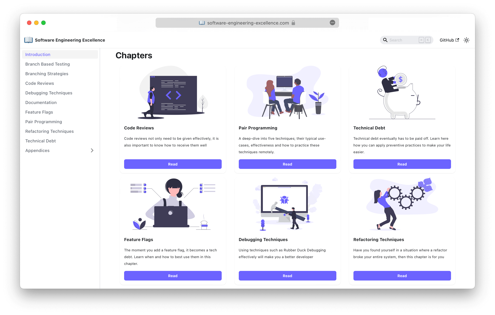

   
	
	<h1>Software Engineering Excellence - Handbook</h1>
	

		<b>Proven practices for developing software successfully</b>
	

	 
	 

The Software Engineering Excellence - Handbook is a comprehensive guide that outlines good practices, principles, and
techniques for developing high-quality software. It covers various aspects of software development, including
requirements gathering, design, coding, testing, deployment, and maintenance. The handbook provides guidance on how to
build software that is secure, reliable, scalable, maintainable, and efficient.

Read it here: https://software-engineering-excellence.com

## Contributions

Contributions are more than welcome, but please carefully read the
[Contribution Guide](https://github.com/software-engineering-excellence/handbook/blob/main/CONTRIBUTING.md).

## Copyright & Licensing

This work is licensed under a
[Creative Commons Attribution-NonCommercial-ShareAlike 3.0 Unported License](http://creativecommons.org/licenses/by-nc-sa/3.0/).

All content is Copyright (©) Tobias Büschel.
